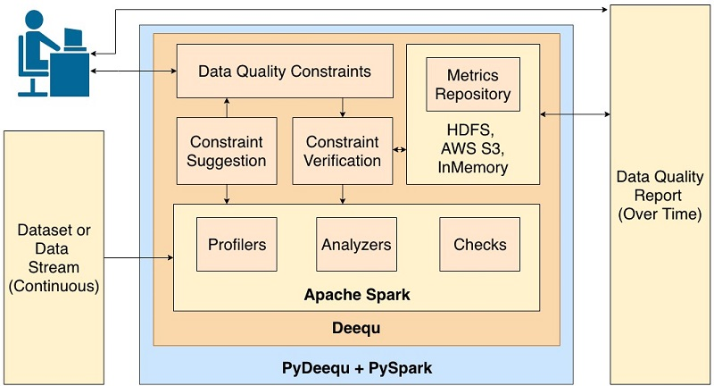

# PyDeequ

PyDeequ is a Python API for [Deequ](https://github.com/awslabs/deequ), a library built on top of Apache Spark for defining "unit tests for data", which measure data quality in large datasets. PyDeequ is written to support usage of Deequ in Python .

[](https://opensource.org/licenses/Apache-2.0) 

There are 4 main components of Deequ, and they are:
- Metrics Computation:
    - `Profiles` leverages Analyzers to analyze each column of a dataset.
    - `Analyzers` serve here as a foundational module that computes metrics for data profiling and validation at scale.
- Constraint Suggestion:
    - Specify rules for various groups of Analyzers to be run over a dataset to return back a collection of constraints suggested to run in a Verification Suite.
- Constraint Verification:
    - Perform data validation on a dataset with respect to various constraints set by you.   
- Metrics Repository
    - Allows for persistence and tracking of Deequ runs over time.



## 🎉 Announcements 🎉
- With PyDeequ v0.1.8, we now officially support Spark3 ! Just make sure you have an environment variable `SPARK_VERSION` to specify your Spark version! 
- We've release a blogpost on integrating PyDeequ onto AWS leveraging services such as AWS Glue, Athena, and SageMaker! Check it out: [Monitor data quality in your data lake using PyDeequ and AWS Glue](https://aws.amazon.com/blogs/big-data/monitor-data-quality-in-your-data-lake-using-pydeequ-and-aws-glue/).
- Check out the [PyDeequ Release Announcement Blogpost](https://aws.amazon.com/blogs/big-data/testing-data-quality-at-scale-with-pydeequ/) with a tutorial walkthrough the Amazon Reviews dataset!
- Join the PyDeequ community on [PyDeequ Slack](https://join.slack.com/t/pydeequ/shared_invite/zt-te6bntpu-yaqPy7bhiN8Lu0NxpZs47Q) to chat with the devs!

## Quickstart

The following will quickstart you with some basic usage. For more in-depth examples, take a look in the [`tutorials/`](tutorials/) directory for executable Jupyter notebooks of each module. For documentation on supported interfaces, view the [`documentation`](https://pydeequ.readthedocs.io/).

### Installation

You can install [PyDeequ via pip](https://pypi.org/project/pydeequ/).

```
pip install pydeequ
```

### Set up a PySpark session
```python
from pyspark.sql import SparkSession, Row
import pydeequ

spark = (SparkSession
    .builder
    .config("spark.jars.packages", pydeequ.deequ_maven_coord)
    .config("spark.jars.excludes", pydeequ.f2j_maven_coord)
    .getOrCreate())

df = spark.sparkContext.parallelize([
            Row(a="foo", b=1, c=5),
            Row(a="bar", b=2, c=6),
            Row(a="baz", b=3, c=None)]).toDF()
```

### Analyzers

```python
from pydeequ.analyzers import *

analysisResult = AnalysisRunner(spark) \
                    .onData(df) \
                    .addAnalyzer(Size()) \
                    .addAnalyzer(Completeness("b")) \
                    .run()

analysisResult_df = AnalyzerContext.successMetricsAsDataFrame(spark, analysisResult)
analysisResult_df.show()
```

### Profile

```python
from pydeequ.profiles import *

result = ColumnProfilerRunner(spark) \
    .onData(df) \
    .run()

for col, profile in result.profiles.items():
    print(profile)
```

### Constraint Suggestions

```python
from pydeequ.suggestions import *

suggestionResult = ConstraintSuggestionRunner(spark) \
             .onData(df) \
             .addConstraintRule(DEFAULT()) \
             .run()

# Constraint Suggestions in JSON format
print(suggestionResult)
```

### Constraint Verification

```python
from pydeequ.checks import *
from pydeequ.verification import *

check = Check(spark, CheckLevel.Warning, "Review Check")

checkResult = VerificationSuite(spark) \
    .onData(df) \
    .addCheck(
        check.hasSize(lambda x: x >= 3) \
        .hasMin("b", lambda x: x == 0) \
        .isComplete("c")  \
        .isUnique("a")  \
        .isContainedIn("a", ["foo", "bar", "baz"]) \
        .isNonNegative("b")) \
    .run()

checkResult_df = VerificationResult.checkResultsAsDataFrame(spark, checkResult)
checkResult_df.show()
```

### Repository

Save to a Metrics Repository by adding the `useRepository()` and `saveOrAppendResult()` calls to your Analysis Runner.
```python
from pydeequ.repository import *
from pydeequ.analyzers import *

metrics_file = FileSystemMetricsRepository.helper_metrics_file(spark, 'metrics.json')
repository = FileSystemMetricsRepository(spark, metrics_file)
key_tags = {'tag': 'pydeequ hello world'}
resultKey = ResultKey(spark, ResultKey.current_milli_time(), key_tags)

analysisResult = AnalysisRunner(spark) \
    .onData(df) \
    .addAnalyzer(ApproxCountDistinct('b')) \
    .useRepository(repository) \
    .saveOrAppendResult(resultKey) \
    .run()
```

To load previous runs, use the `repository` object to load previous results back in.

```python
result_metrep_df = repository.load() \
    .before(ResultKey.current_milli_time()) \
    .forAnalyzers([ApproxCountDistinct('b')]) \
    .getSuccessMetricsAsDataFrame()
```

## [Contributing](https://github.com/awslabs/python-deequ/blob/master/CONTRIBUTING.md)
Please refer to the [contributing doc](https://github.com/awslabs/python-deequ/blob/master/CONTRIBUTING.md) for how to contribute to PyDeequ.

## [License](https://github.com/awslabs/python-deequ/blob/master/LICENSE)

This library is licensed under the Apache 2.0 License.

******

## Contributing Developer Setup

1. Setup [SDKMAN](#setup-sdkman)
1. Setup [Java](#setup-java)
1. Setup [Apache Spark](#setup-apache-spark)
1. Install [Poetry](#poetry)
1. Run [tests locally](#running-tests-locally)

### Setup SDKMAN

SDKMAN is a tool for managing parallel Versions of multiple Software Development Kits on any Unix based
system. It provides a convenient command line interface for installing, switching, removing and listing
Candidates. SDKMAN! installs smoothly on Mac OSX, Linux, WSL, Cygwin, etc... Support Bash and ZSH shells. See
documentation on the [SDKMAN! website](https://sdkman.io).

Open your favourite terminal and enter the following:

```bash
$ curl -s https://get.sdkman.io | bash
If the environment needs tweaking for SDKMAN to be installed,
the installer will prompt you accordingly and ask you to restart.

Next, open a new terminal or enter:

$ source "$HOME/.sdkman/bin/sdkman-init.sh"

Lastly, run the following code snippet to ensure that installation succeeded:

$ sdk version
```

### Setup Java

Install Java Now open favourite terminal and enter the following:

```bash
List the AdoptOpenJDK OpenJDK versions
$ sdk list java

To install For Java 11
$ sdk install java 11.0.10.hs-adpt

To install For Java 11
$ sdk install java 8.0.292.hs-adpt
```

### Setup Apache Spark

Install Java Now open favourite terminal and enter the following:

```bash
List the Apache Spark versions:
$ sdk list spark

To install For Spark 3
$ sdk install spark 3.0.2
```

### Poetry

Poetry [Commands](https://python-poetry.org/docs/cli/#search)

```bash
poetry install

poetry update

# --tree: List the dependencies as a tree.
# --latest (-l): Show the latest version.
# --outdated (-o): Show the latest version but only for packages that are outdated.
poetry show -o
```

## Running Tests Locally

Take a look at tests in `tests/dataquality` and `tests/jobs`

```bash
$ poetry run pytest
```